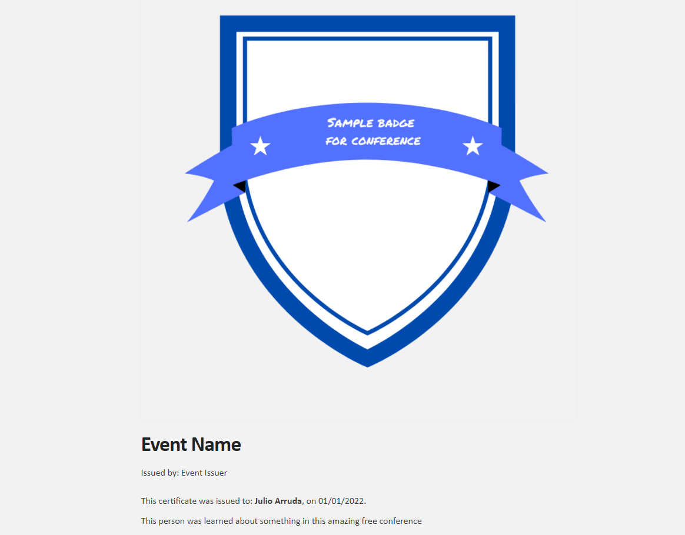
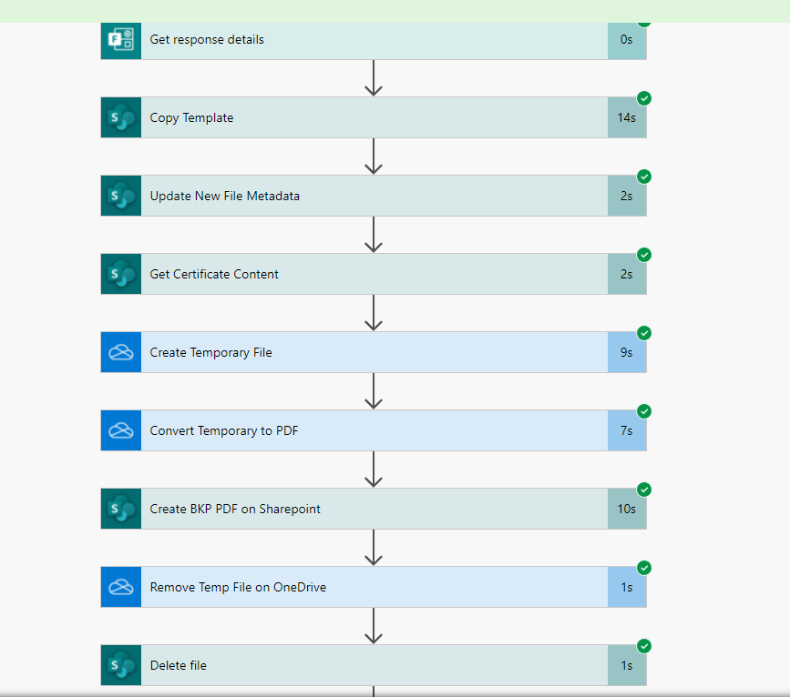
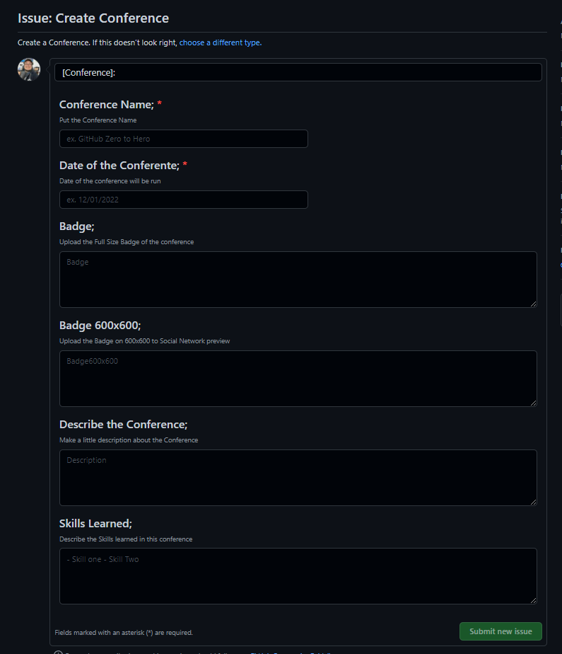

# Events Badge Generator

This project was born from creating badges for free training or conferences at a low cost.
My main idea was to create automated certificates based on a participants list and share a badge online to validate the authenticity of this one.

The core of this project is GitHub because I'm using GitHub to host my source code and host the page and execute a big part of the process.

This project is separated into two main parts:
- Certificate Creation
- Event and Badge Creation
- The first one is based on this content from my friend, the MVP Gustavo de Moraes: [Live Solidária - Gerando seus certificados com Power Automate
](https://www.youtube.com/watch?v=WYgRjHcgloQ)

## Certificate Creation
I'm using Power Automate and SharePoint 365 to create the certificate and share it with the participants.

I'm sharing in this repository, my workflow on Power Automate to create this.

This workflow does this steps:
- Copy a certificate template on a SharePoint Library
- Update the Metadata of the file
- Generate a PDF
- Create a Share link to this PDF
- Open an Issue on GitHub Repository with the Participant Informations.

## Event Page Creation
The second part is entirely on GitHub. 
First, you can make a fork of this repository and check if the GitHub Pages is enabled for you; if not, please allow it on the root directory.
You can add a custom DNS too.

Now, you need to check the Actions Secrets, because some secrets are necessary to execute the project, are the secrets:
- SSH_KEY
- KNOWN_HOSTS
- MAIL_USERNAME
- MAIL_PASSWORD

### The SSH secrets need to have permission to commit in your GitHub repositories. (it's necessary because I created this process using two different repositories in the first moment, and now, I need to refactor the actions).

## Creating a New Conference

To create a new conference, you need to open an issue and put the necessary information.

After you create the issue, the Github Actions will be started, and execute the process to create a conference directory and files inside the GitHub Pages, and close the issue.

## Creating a New Badge's Page

To create a badge for the participants, this repository has a specific action called badge.yml.
This action will be run automatically when a new issue with the text in the title was created: [Certificate].
The idea about this issue, is that this one running automatically, created by Power Automated flow.

After this action run, you can see a new URL for the participant badge on the site.